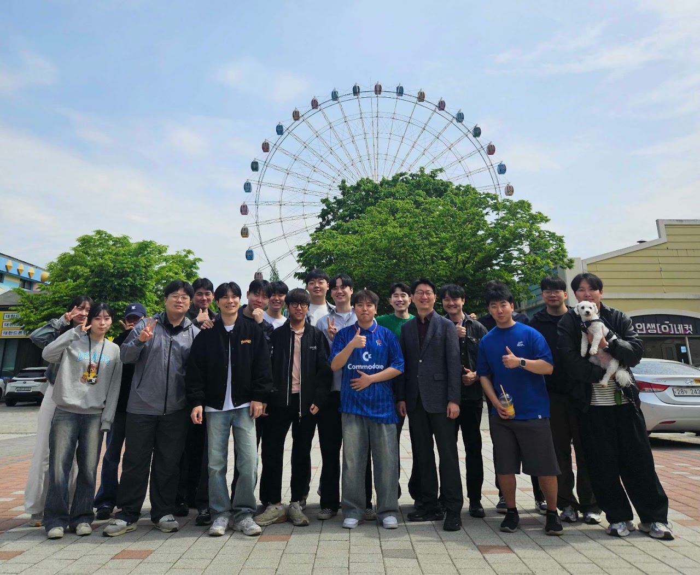
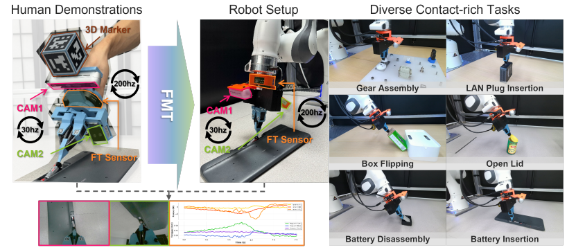

## GIST AILAB 👋

- 😄 [Artificial Intelligence Laboratory](https://ailab.gist.ac.kr/) in [GIST](https://www.gist.ac.kr/kr/main.html)
- 🤵 Advised by professor [Kyoobin Lee](https://sites.google.com/view/gistailab/members/professor?authuser=0).
- 🤝 [Contact](mailto:havynine9@gist.ac.kr?subject=[GitHub]%20Source%20Han%20Sans) 
- 👐 [Internship](https://sites.google.com/view/gistailab/internship?authuser=0)

#### Latest Research
ManipForce (ICRA 2026)           |  BiGraspFormer (ICRA 2026)
:-------------------------:|:-------------------------:
 | []

